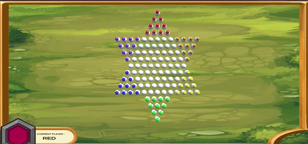

# Project
The following project is an implementation of the Mini-Max algorithm in the game of Chinese checkers. It has been done as a task for "Programming 2" course at Södertörn university. the whole project has been completed in 5 weeks. This was an individual project.

# What have i learned

•  How to implement simple Ai to strategic solved games.

•  I expanded my knowledge on code optimization.

•  How to creat tile based game.

• I expended my knowledge on Ui implementation in [Unity].

• How to operate on local files from c# script [Save/Load].

• How to balance simple Ai in stategic games // Making game fair for non-computer players.

# Tools and methods used during the project 

• TestLink 

• Sprint method 
